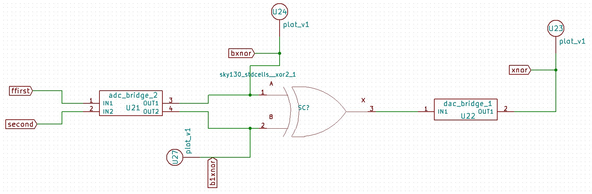
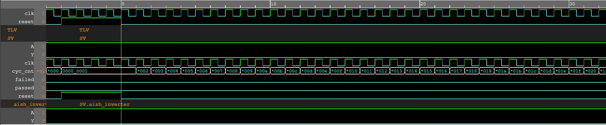
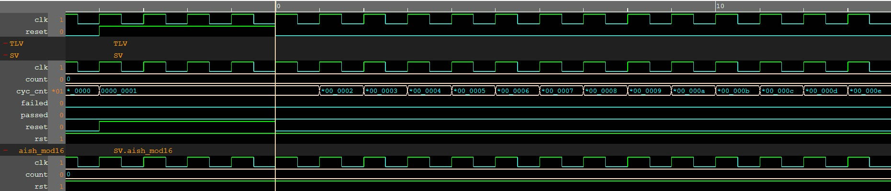
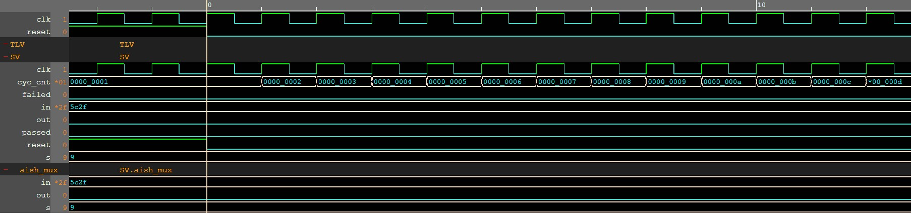
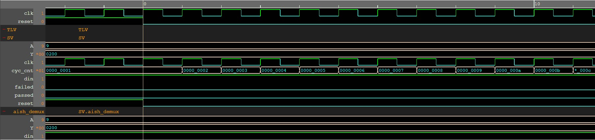

<h1 align="center"> Design and Implementation<br>of<br>Automatic Security Monitoring System </h1>
Design and Implementation of automatic Security Monitoring System

<h2>Index</h2>
<!-- START doctoc generated TOC please keep comment here to allow auto update -->
<!-- DON'T EDIT THIS SECTION, INSTEAD RE-RUN doctoc TO UPDATE -->

- [Abstract](#abstract)
- [Circuit Diagram](#circuit-diagram)
  - [1. Security System](#1-security-system)
  - [2. Window Comparator](#2-window-comparator)
  - [3. Window Comparator Output](#3-window-comparator-output)
  - [4. XNOR of Window Comparator Output](#4-xnor-of-window-comparator-output)
  - [5. Alert System mux demux](#5-alert-system-mux-demux)
- [Output Waveform](#output-waveform)
  - [1. Window Comparator Input](#1-window-comparator-input)
  - [2. Window Comparator Output](#2-window-comparator-output)
  - [3. Window Comparator Output after removing spikes using back to back inverter](#3-window-comparator-output-after-removing-spikes-using-back-to-back-inverter)
  - [4. XNOR Output of Window Comparator](#4-xnor-output-of-window-comparator)
  - [5. MOD16 Waveform](#5-mod16-waveform)
  - [6. Current Door Status](#6-current-door-status)
  - [7. Alert System](#7-alert-system)
- [Makerchip](#makerchip)
  - [1. Inverter](#1-inverter)
  - [2. MOD16](#2-mod16)
  - [3. MUX](#3-mux)
  - [4. DEMUX](#4-demux)
- [Verilog Code](#verilog-code)
  - [1. Inverter](#1-inverter-1)
  - [2. MOD16](#2-mod16-1)
  - [3. MUX](#3-mux-1)
  - [4. DEMUX](#4-demux-1)
- [Software Tools Used](#software-tools-used)
- [Acknowlegdements](#acknowlegdements)
- [Social media IDs](#social-media-ids)

<!-- END doctoc generated TOC please keep comment here to allow auto update -->


## Abstract
Many security systems are used in buildings where doors are to be monitored e.g. in prison. The condition of doors that is if the door is closed or open is monitored continuously in the analog form while data is transmitted in digital form to the monitor panel for data processing and alerting. Hence, the circuit implemented is the application of mixed signal. To design this circuit, Window Comparator is used to generate a square wave from AC input voltage. A MOD-16 counter has 16 states in its count sequence and used for counting operation. Output from MOD-16 is given to selection lines of 16x1 Multiplexer. A 16x1 Multiplexer is used for data monitoring operation and after transmission of data, 1x16 Demultiplexer is used to give alert. This design reduces the amount of wiring. It transfers the door data to the alert system using only single wire.


## Circuit Diagram

### 1. Security System


### 2. Window Comparator


### 3. Window Comparator Output


### 4. XNOR of Window Comparator Output



### 5. Alert System mux demux


<br>

## Output Waveform

### 1. Window Comparator Input


### 2. Window Comparator Output


### 3. Window Comparator Output after removing spikes using back to back inverter


### 4. XNOR Output of Window Comparator


### 5. MOD16 Waveform


### 6. Current Door Status

> **Door4**, **Door8** and **Door12** are kept open while all other doors are closed


### 7. Alert System

> It is alerted that **Door4**, **Door8** and **Door12** are open


<br>

## Makerchip

### 1. Inverter



### 2. MOD16



### 3. MUX



### 4. DEMUX



<br>

## Verilog Code

### 1. Inverter

```verilog
module aish_inverter(output Y, input A);
    not (Y, A);
endmodule
```

### 2. MOD16

```verilog
module aish_mod16 (clk,rst,count);

input clk,rst;
output reg[3:0] count;

always @ (posedge clk , posedge rst ) begin
	if (rst)
		count <= 0;
	else
		count <= count+1;
	end
endmodule
```

### 3. MUX

```verilog
module aish_mux (input wire[15:0] in, input wire[3:0] s, output reg out);

always @ (1)
case(s)

	0 : out = in[0];
	1 : out = in[1];
	2 : out = in[2];
	3 : out = in[3];
	4 : out = in[4];
	5 : out = in[5];
	6 : out = in[6];
	7 : out = in[7];
	8 : out = in[8];
	9 : out = in[9];
	10: out = in[10];
	11: out = in[11];
	12: out = in[12];
	13: out = in[13];
	14: out = in[14];
	15: out = in[15];
endcase
endmodule
```

### 4. DEMUX

```verilog
module aish_demux (output reg [15:0] Y, input din, input [3:0] A);
always @(Y, A) begin
    case (A)
        4'b0000 : begin Y[0] = din; Y[15:1] = 0; end
        4'b0001 : begin Y[1] = din; Y[0] = 0;  Y[15:2] = 0; end
        4'b0010 : begin Y[2] = din; Y[1:0] = 0;  Y[15:3] = 0; end
        4'b0011 : begin Y[3] = din; Y[2:0] = 0;  Y[15:4] = 0; end
        4'b0100 : begin Y[4] = din; Y[3:0] = 0;  Y[15:5] = 0; end
        4'b0101 : begin Y[5] = din; Y[4:0] = 0;  Y[15:6] = 0; end
        4'b0110 : begin Y[6] = din; Y[5:0] = 0;  Y[15:7] = 0; end
        4'b0111 : begin Y[7] = din; Y[6:0] = 0;  Y[15:8] = 0; end
        4'b1000 : begin Y[8] = din; Y[7:0] = 0;  Y[15:9] = 0; end
        4'b1001 : begin Y[9] = din; Y[8:0] = 0;  Y[15:10] = 0; end
        4'b1010 : begin Y[10] = din; Y[9:0] = 0;  Y[15:11] = 0; end
        4'b1011 : begin Y[11] = din; Y[10:0] = 0;  Y[15:12] = 0; end
        4'b1100 : begin Y[12] = din; Y[11:0] = 0;  Y[15:13] = 0; end
        4'b1101 : begin Y[13] = din; Y[12:0] = 0;  Y[15:14] = 0; end
        4'b1110 : begin Y[14] = din; Y[13:0] = 0;  Y[15] = 0; end
        4'b1111 : begin Y[15] = din; Y[14:0] = 0;  end
    endcase   
end
endmodule
```

<br>

## Software Tools Used

<br>

1. [eSim](https://esim.fossee.in/home) 

> eSim is a free and open-sourced EDA tool for circuit design, simulation, analysis and PCB design. It is an integrated tool built using free/libre and open source software such as KiCad, Ngspice, Verilator, makerchip-app, sandpiper-saas and GHDL. eSim is released under GPL.

2. [KiCad](https://www.kicad.org/)

> KiCad's Schematic Editor supports everything from the most basic schematic to a complex hierarchical design with hundreds of sheets. It helps to create our own custom symbols or use some of the thousands found in the official KiCad library. We can verify our design with integrated SPICE simulator and electrical rules checker.

3. [Ngspice](http://ngspice.sourceforge.net/)

>  Ngspice is a mixed-level/mixed-signal electronic circuit simulator. Ngspice implements three classes of analysis: nonlinear DC analyses, Nonlinear transient analyses, linear AC analyses.
   
4. [Verilator](https://www.veripool.org/verilator/)

>  Verilator is a free and open-source software tool which converts Verilog code to a cycle-accurate behavioral model in C++ or SystemC.
   
5. [Makerchip](https://www.makerchip.com/)
>  A web-based IDE that is used to design and simulate digital circuits using Verilog, and the language extension of Verilog, TL-Verilog.  

6. [SkyWater SKY130 PDK](https://skywater-pdk.rtfd.io/)

> The SkyWater Open Source PDK is a collaboration between Google and SkyWater Technology Foundry to provide a fully open source Process Design Kit and related resources, which can be used to create manufacturable designs at SkyWater’s facility.


## Acknowlegdements
1. [FOSSEE](https://fossee.in/), [IIT Bombay](http://iitb.ac.in/)
2. Kunal Ghosh, Co-founder, [VSD Corp. Pvt. Ltd.](https://www.vlsisystemdesign.com/) - [Email](kunalpghosh@gmail.com)
3. Sumanto Kar, eSim Team, [FOSSEE](https://fossee.in/)
4. [Spoken Tutorial](https://spoken-tutorial.org/)
5. [Chips to Startup (C2S)](https://www.c2s.gov.in/)
6. [Google](https://www.google.co.in/)

## Social media IDs
SPOKEN TUTORIAL: https://spoken-tutorial.org/ \
SLACK: https://join.slack.com/t/fossee-iitbombay/shared_invite/zt-1hjcs4lxf-iJbNRcnmtfXYOc9ahEvp1g \
FACEBOOK: https://www.facebook.com/FOSSEENMEICT/ \
TWITTER: https://twitter.com/FOSSEE/ \
INSTAGRAM: https://www.instagram.com/fossee_nmeict/ \
LINKEDIN: https://www.linkedin.com/company/fossee-iitb/
